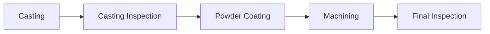

# Process Improvement of Casting Inspection Using Six Sigma DMAIC Methodology to Reduce Downstream Processing Waste

> Industrial quality improvement case study applying the Six Sigma DMAIC methodology to analyze casting inspection performance, identify defect escapes, and recommend process improvements to reduce downstream manufacturing waste.

---

## Overview

This is a industrial process improvement case study focused on enhancing the effectiveness of the casting inspection process using the Six Sigma DMAIC (Define, Measure, Analyze, Improve, Control) methodology.

The study investigates why irreparable casting defects escaped the initial inspection stage and reached downstream manufacturing operations, resulting in unnecessary processing costs and wasted machining capacity.

Based on production data, shop-floor observations, and root cause analysis, the project proposes practical recommendations to standardize inspection practices and improve inspection performance.

---

## Business Problem

Irreparable casting defects were not consistently detected during casting inspection and continued into powder coating and machining before being identified during final inspection.

These defect escapes resulted in:

- Wasted powder coating and machining costs
- Loss of machining capacity
- Additional inspection effort
- Inefficient use of downstream manufacturing resources

The project focuses on improving the inspection process rather than modifying the casting process itself.

---

## Project Objectives

- Evaluate the effectiveness of the existing casting inspection process.
- Measure baseline process performance using Six Sigma quality metrics.
- Identify root causes of defect escapes.
- Recommend practical inspection process improvements.
- Develop a control plan to sustain future improvements.

---

## Project Scope

### In Scope

- Visual inspection of casting components
- Identification of irreparable casting defects
- Inspection standardization
- Inspection checklist development
- Operator training recommendations
- Supervisor audit recommendations
- Inspection documentation

### Out of Scope

- Casting process parameters
- Furnace operation
- Die design modifications
- Alloy composition

---

## DMAIC Methodology

### Define

- Defined the quality problem.
- Identified project scope and objectives.
- Mapped the existing inspection process.

### Measure

Collected production data over a 15-day observation period and established baseline process performance using:

- Defect Escape Rate
- First Pass Yield (FPY)
- Defects Per Million Opportunities (DPMO)
- Cost of Poor Quality (COPQ)

### Analyze

Performed:

- Shop-floor observations
- 5 Why Analysis
- Fishbone (Cause-and-Effect) Analysis

The investigation determined that inspection practices—not the casting process—were the primary source of defect escapes.

### Improve

Recommended:

- Standardized inspection criteria
- Standard Operating Procedure (SOP)
- Inspection checklist
- Structured operator training
- Supervisor audits
- KPI monitoring
- Feedback system between inspection stages

### Control

Proposed a practical control plan including:

- SOP reviews
- Inspection checklists
- Supervisor audits
- KPI monitoring
- Defect tracking
- Training records
- Process documentation

---

## Manufacturing Process Workflow



---

## Data Summary

| Parameter | Value |
|-----------|------:|
| Observation Period | 15 Days |
| Components Processed | 9,000 |
| Defect Escapes | 189 |
| Defect Escape Rate | 2.10% |
| First Pass Yield | 97.90% |
| DPMO | 21,000 |
| Sigma Level | ~3.5 Sigma |

---

## Tools & Techniques

| Tool | Purpose |
|------|---------|
| Six Sigma DMAIC | Structured process improvement |
| First Pass Yield (FPY) | Process performance measurement |
| DPMO | Six Sigma metric |
| Cost of Poor Quality (COPQ) | Financial impact analysis |
| Fishbone Diagram | Root cause analysis |
| 5 Why Analysis | Cause investigation |
| Shop-floor Observation | Process understanding |
| KPI Monitoring | Performance measurement |

---

## Key Calculations

### First Pass Yield (FPY)

```
FPY = ((N − D) / N) × 100
```

**Result:** **97.90%**

---

### Defects Per Million Opportunities (DPMO)

```
DPMO = (D / (N × O)) × 1,000,000
```

**Result:** **21,000**

---

### Cost of Poor Quality (COPQ)

Included:

- Powder coating loss
- Machining cost loss

| Metric | Value |
|---------|-------|
| Processing Loss (15 Days) | ₹3,591 |
| Annual Processing Loss | ₹71,820 |
| Machining Capacity Loss | 10.24 Hours |
| Annual Capacity Loss | 204.8 Hours |

---

## Root Cause Analysis

The analysis identified several process-related factors contributing to defect escapes:

- No standardized inspection criteria
- Undefined acceptance and rejection limits
- No inspection checklist
- Limited operator training
- Inspection quantity prioritized over quality
- Weak supervisory monitoring
- Poor communication between inspection stages

Root cause analysis was conducted using:

- 5 Why Analysis
- Fishbone Diagram

---

## Recommended Improvements

| Root Cause | Recommendation |
|------------|---------------|
| Subjective inspection decisions | Standardize inspection criteria |
| Undefined acceptance limits | Define inspection standards |
| No SOP | Develop Standard Operating Procedure |
| No inspection checklist | Introduce standardized checklist |
| Limited operator training | Conduct structured training |
| Quantity-focused inspection | Include quality KPIs |
| Weak supervisory review | Increase supervisor audits |
| Poor communication | Establish feedback system |
| Limited data review | Perform periodic trend analysis |

---

## Expected Performance Targets

| Performance Metric | Current | Target |
|-------------------|--------:|-------:|
| Defect Escape Rate | 2.10% | <1.00% |
| First Pass Yield | 97.90% | >99.00% |
| DPMO | 21,000 | <10,000 |
| Sigma Level | ~3.5 | >3.8 |
| Annual Processing Loss | ₹71,820 | <₹34,200 |

> These targets represent proposed improvements.

---

## Proposed Control Plan

The proposed control plan includes:

- Standard Operating Procedure reviews
- Visual inspection standards
- Inspection checklists
- Quarterly operator training
- Weekly supervisor audits
- Daily defect tracking
- Monthly KPI monitoring
- Corrective action tracking
- Process documentation

### Key Performance Indicators (KPIs)

- Defect Escape Rate
- First Pass Yield (FPY)
- DPMO
- Number of Defect Escapes
- SOP Compliance
- Training Completion

---

## Business Impact

Implementation of the proposed recommendations could:

- Reduce downstream processing waste
- Improve inspection consistency
- Lower powder coating and machining losses
- Improve machine utilization
- Strengthen inspection accountability
- Standardize quality practices
- Improve communication between departments
- Support continuous quality improvement

---

## Key Learnings

- Applied the DMAIC methodology to an industrial quality problem.
- Evaluated process performance using Six Sigma metrics.
- Performed structured root cause analysis.
- Quantified the financial impact using COPQ.
- Developed practical inspection process improvement recommendations.
- Designed a control plan for sustaining quality improvements.

---

## Limitations

- Study conducted over a 15-day observation period.
- Focused only on irreparable casting defects.
- Individual defect categories were not recorded separately.
- Recommendations were proposed

---

## Future Improvements

- Implement the proposed inspection improvements.
- Digitize inspection checklists.
- Develop a defect-wise Pareto analysis.
- Integrate KPI dashboards for real-time monitoring.
- Evaluate long-term process performance after implementation.

## Author

**Parth Kumbhar**

Mechanical Engineering • Manufacturing Operations • Quality Engineering • Six Sigma
